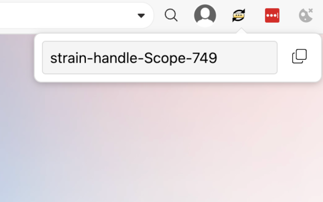

# Simple Passphrase Generator

Chrome extension that generates secure passphrases in the format `{word}-{word}-{word}-{number}`.

## Usage

Click the extension icon and use:
- "Generate" for a new passphrase
- "Copy" to copy to clipboard

## Author

Alessio Signorini (alessio@signorini.us)

## License

MIT License
